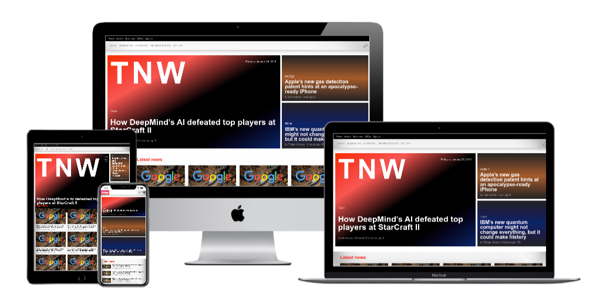

<h1 align="center">TheNextweb Clone App 👋</h1>

  
  

> This is an attempt to clone [The Next Web](https://thenextweb.com) as part of completing the curriculum at [microverse](https://microverse.org)

## Built With

- HTML5
- CSS3

### ✨ Demo

[Demo](https://rawcdn.githack.com/abruzy/thenextweb/103a0357974b282525dbe2eff0ae9b3f8e64fd59/index.html)

## Authors

- [Abubakar Diallo](https://github.com/abruzy)

👤 **Abubakar Diallo**

* Twitter: [@abruzy01](https://twitter.com/abruzy01)
* Github: [@abruzy](https://github.com/abruzy),
          [Saba Younis](https://github.com/sabayounis)
* LinkedIn: [@abubakardiallo](https://linkedin.com/in/abubakardiallo)

## 🤝 Contributing

Contributions, issues and feature requests are welcome!

Feel free to check the [issues page](https://github.com/abruzy/react-meal-catalogue/issues).

## Show your support

Give a ⭐️ if you like this project!

## Acknowledgments

- [Microverse](https://www.microverse.org/)

## 📝 License

This project is [MIT](lic.url) licensed.